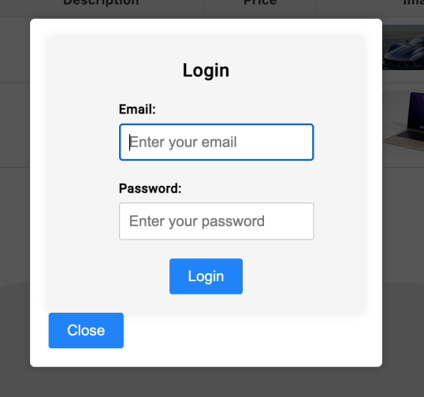
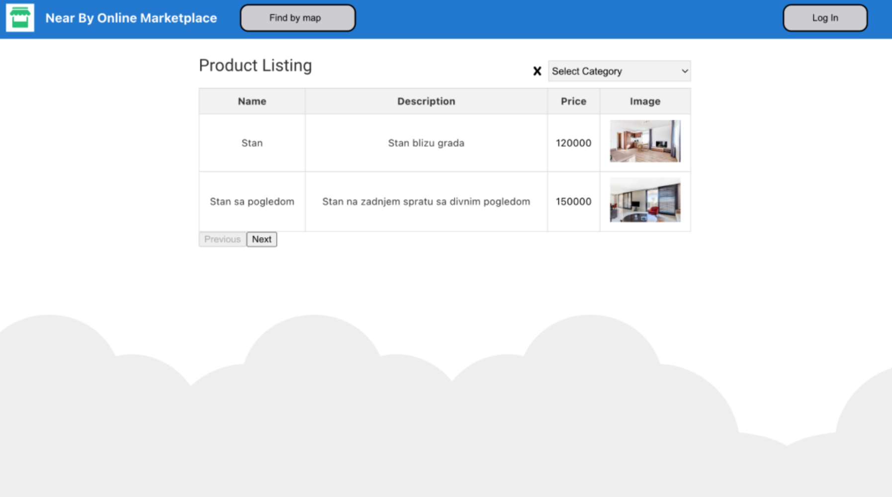
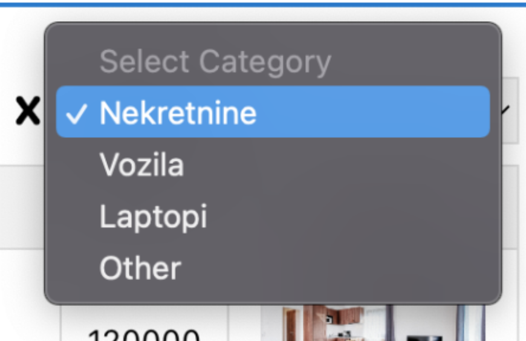
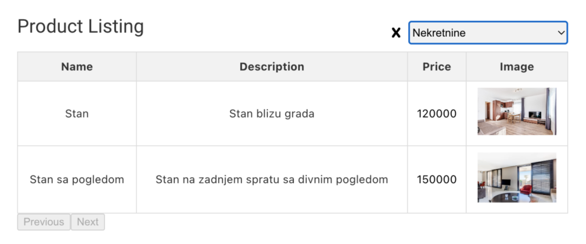
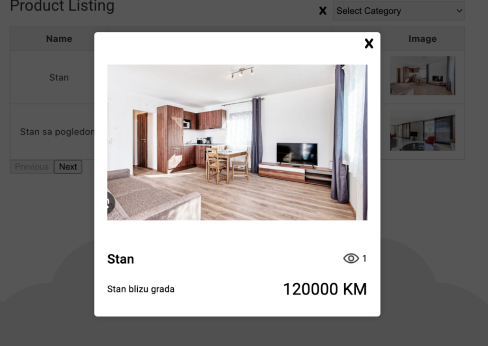
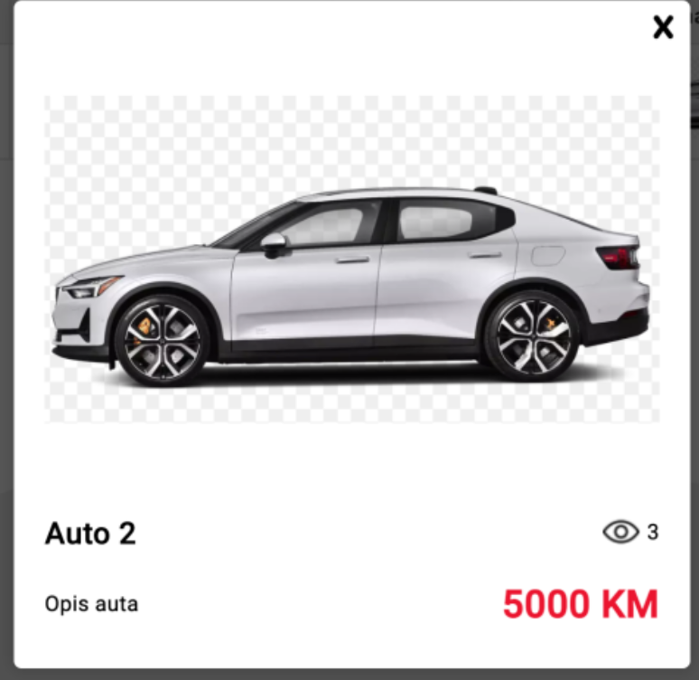
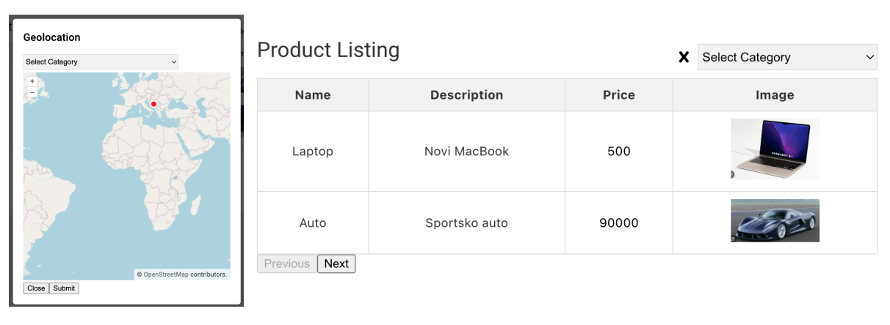
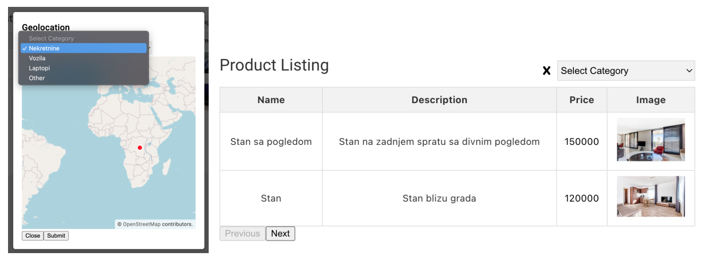

# NearByApplication - frontend

This project represents frontend code for “Near By” application, an online marketplace with product management system for a 
company that will allow users to easily find products close by. 
Implementation is done in Angular 16.

## Project structure
* **dropdown-menu:** component created for the category dropdown list
* **login-modal:** component created for login
* **map:** component created for the map only
* **modal:** component created for geolocation modal
* **product-listing:** component created to display all products
* **product-modal:** component created to display a single product
* **services:** folder containing services
* **app. files:** toolbar implementation
* **assets:** image folder
* **types:** folder containing all created types from the database to avoid using any

## Modules
The system contains several modules:
* login
* home page
* display of all categories and filtering
* product display
* filtering by location

### Login

Login requires users credentials to access the app.

  

### Home page

On this page, all products from the database are displayed. Pagination was implemented because the
dataset is large, with lots of data; to avoid returning and displaying all data at once, pagination was
required. In this case, it is set to display two products per page (for representation). In an ideal case, it
would be 10.

  

### Display all categories

Categories are displayed in a dropdown list:

  

### Filtering by categories

Filtering by the selected categories from the list was successfully implemented. The screenshot shows filtering by a category (in this case there are only two products).

  

By clicking the X icon next to the categories, the category filter is cleared.

### Product display

Each row in the product table can be clicked. When a product is clicked, product information is shown as
illustrated in next screenshot:

  

In this view, the views value (eye icon) is important: it represents how many times a product has been
viewed. With each click on a product, this value increases. Also, if an item is on SALE, its price is
displayed in red, as shown in the screenshot.

  

### Filtering by location

On the home page, in the toolbar at the top, there is a “Find by map” button. Clicking it opens a new
modal where a world map and a category dropdown are displayed.

  

By clicking on the map, it is possible to select a point from which we want to list the closest products.
Clicking the Submit button closes the modal and the list of products ordered by location is shown in the
main table.

  

Pagination is supported in case of the large dataset. In the original example, the geolocation is ordered
correctly because the laptop is located near the northern border of Bosnia, while the car is located in
Europe. All other products (not shown on the first page) are farther away, which indicates products are
ordered correctly.

It is also possible to filter the nearest products to the chosen map location by a category, which is why the
category dropdown exists in this modal as well.

  

### Possible improvements

**Regarding UI and functionalities:** The next step after login would be to add buttons for adding, editing, and deleting products and categories.
Those routes can only be executed by a logged-in user (some by admin, some by user). In addition,
various other filters could be added to the home page. 

The entire UI could be updated to be more user friendly and to be more visually appealing.

**Regarding technology:** The entire app could be refactored and could use newer Angular with some newer dependencies.
